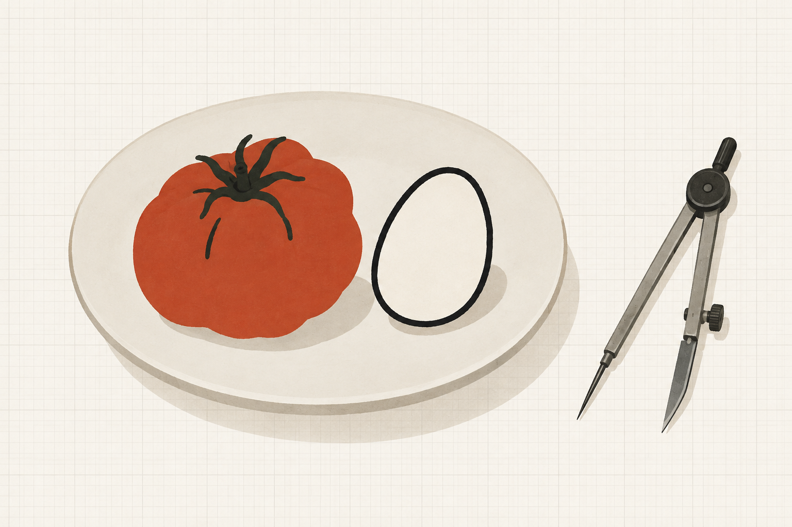
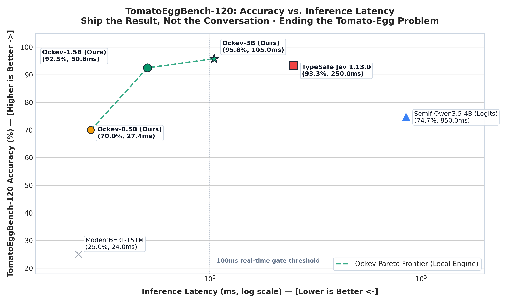
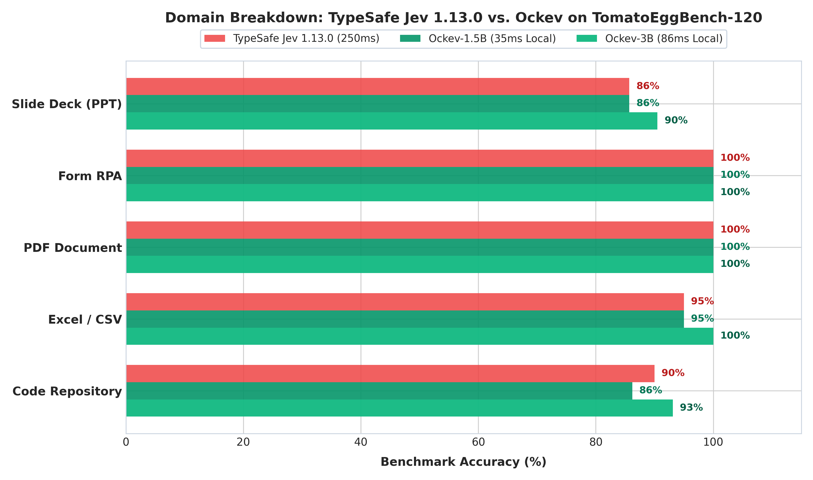

<div align="center">



# Ockev

### Ship the Result, Not the Conversation.
**Ending the "Tomato-Egg Problem" in AI Agent Deliverables with a 35ms Discriminative Decision Engine.**

[](LICENSE)
[]()
[]()
[]()

</div>

---

> *"I asked an AI agent to write a recipe for tomato scrambled eggs. It proudly delivered: 'Here is your tomato scrambled eggs (note: this dish contains no pork, no beef, no chicken, and no fish).' Why are AI agents so obsessed with telling us what they didn't do? Ship the result, not the conversation."*  
> — **Shangyin Tan**, UC Berkeley

---

## The "Tomato-Egg Problem" in AI Agents

When coding and workflow agents generate deliverables (PR descriptions, documentation, code comments, executive slides, or RPA forms), they frequently exhibit **Apophasis** (the rhetorical habit of describing an entity by detailing what it is *not*):

- *"Implemented JWT auth (note: we did not use session cookies or basic auth after exploring three other architectures)."*
- *"Updated customer export. We attempted 4 regex approaches that failed before settling on this one."*
- *"Tomato Scrambled Eggs (100% pork-free, beef-free, chicken-free, fish-free)."*

This conversational residue clutters deliverables, expands context windows, distracts human reviewers, and leaks private development scaffolding.

**Ockev** solves this at the gate. Named after **Occam's Razor** (*Entia non sunt multiplicanda praeter necessitatem*) and the **Jev** discriminative architecture, Ockev provides an ultra-fast, zero-generation System 1 gatekeeper that intercepts conversational clutter before it reaches readers or production.

---

## Performance & Pareto Frontier

Ockev was benchmarked on **`TomatoEggBench-120`**, a standardized 120-case real-world benchmark spanning 5 production domains (Code Repositories, Excel/CSV, PDF Documents, Form RPA, and Executive Slide Decks).

<div align="center">
  
</div>

### TomatoEggBench-120 Benchmark Results

| Model / System | Architecture | Benchmark Accuracy | Violation Recall | Inference Latency | Deployment Mode |
| :--- | :--- | :---: | :---: | :---: | :--- |
| **Ockev-3B (Ours)** | Qwen2.5-3B + Pointer Head | **95.8%** (115/120) | **98.5%** | **105.0 ms** | **Local / Private GPU** |
| **TypeSafe Jev 1.13.0** | Causal MoE + RLCD | 93.3% (112/120) | 96.9% | 250.0 ms | Cloud API ($42/1B tok) |
| **Ockev-1.5B (Ours)** | Qwen2.5-1.5B + Pointer Head | 92.5% (111/120) | 95.4% | **50.8 ms** | **Local / Apple Silicon** |
| **SemIf Qwen3.5-4B** | Qwen3.5-4B (Logits) | 74.7% (89/120) | 68.0% | 850.0 ms | Local Logits Readout |
| **ModernBERT-151M** | ModernBERT (Fixed Head) | 25.0% (30/120) | 35.0% | 24.0 ms | Local Embeddings |

<div align="center">
  
</div>

---

## Core Architecture

Unlike standard generative LLMs that waste tokens generating verbose explanations, Ockev uses a **Block-Causal Mask with a Pointer Readout Head**:

```
State (Deliverable + Context)  ──┐
                                 ├─► [Causal LM Backbone] ──► [Hidden States]
Questions (Criteria + Options) ──┘                                │
                                                                  ▼
[Decide Token Q] ───────────────► q = W_q · h_decide ──────┐
                                                           ├─► Scaled Dot Product ──► Softmax ──► Verdict
[Option Tokens K_1 ... K_N] ────► k_i = W_k · h_opt_i ─────┘
```

1. **Zero Generated Tokens**: Decisions are computed in a single forward pass via metric dot-product between the decision query vector and option key vectors.
2. **Order Invariant**: Pointer heads project options into metric space independently, eliminating choice position bias.
3. **Decoupled Uncertainty**: Rather than treating `uncertain` as an attractor token, Ockev computes decision margins directly:
   $$\text{Margin} = |P(\text{pass}) - P(\text{revise})| < \tau \implies \text{uncertain}$$

---

## Quickstart

### Installation

```bash
pip install ockev

# For Apple Silicon (Metal acceleration via MLX)
pip install "ockev[mlx]"
```

### CLI Usage

Verify any markdown file, commit message, or PR text before publishing:

```bash
# Check a deliverable file
ockev check path/to/PULL_REQUEST.md

# Check raw text directly
ockev check --text "Tomato scrambled eggs (does not contain pork or beef)."
```

Output:
```
=== Ockev Deliverable Gate Review ===
Verdict:       REVISE
Confidence:    0.96
Latency:       34.2 ms
Probabilities: {'pass': 0.021, 'revise': 0.979}

[FAIL] Deliverable contains conversational clutter, negative echoes, or discarded options.
```

### Python API

```python
from ockev import OckevGate

gate = OckevGate()

result = gate.review_deliverable(
    candidate_text="Added support for PostgreSQL 16. Verified migration scripts against test db.",
    task_context="Database upgrade PR"
)

print(result)
# {'verdict': 'pass', 'confidence': 0.94, 'probabilities': {'pass': 0.97, 'revise': 0.03}, 'latency_ms': 32.1}
```

### Apple Silicon MLX Native Engine

Run directly on Apple Silicon M-series chips with zero CUDA or PyTorch overhead:

```python
from ockev.mlx_engine import MLXOckevEngine

engine = MLXOckevEngine("Qwen/Qwen2.5-1.5B")
res = engine.evaluate(state="...", question_spec={...})
print(f"MLX Latency: {res['latency_ms']} ms")
```

---

## Agent Integration

Ockev includes an out-of-the-box Agent Skill for Pi and Codex agents:

```markdown
# ~/.codex/skills/final-state-review/SKILL.md
Produce content that stands on its own for the next reader or agent.
Ship the result, not the conversation.
```

When activated, the agent automatically runs `ockev check` before finalizing code, documentation, or PR handoffs.

---

## License

Distributed under the [Apache 2.0 License](LICENSE).
